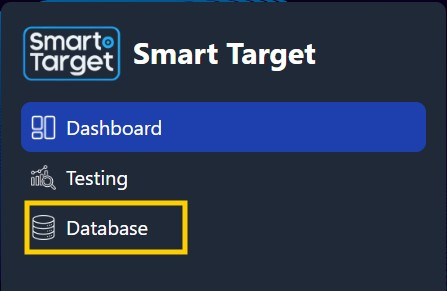
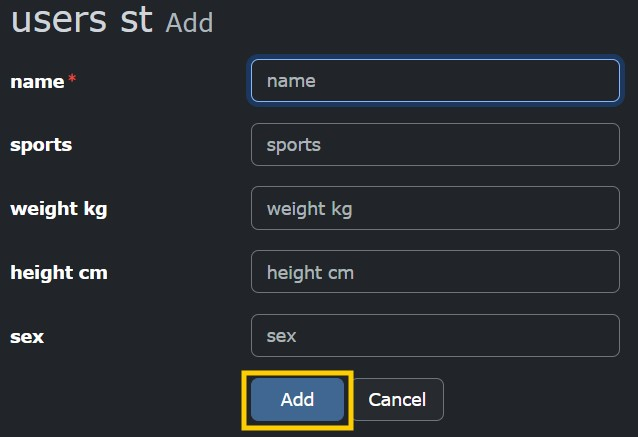
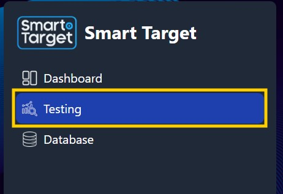
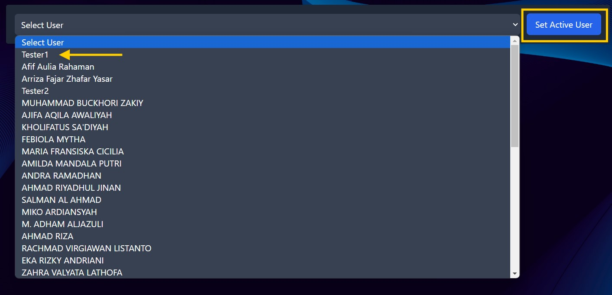

Here's a draft for the README file with user guidelines:

---

# User Guidelines

Welcome to the Smart Target system! This guide will help you with user registration and testing within the application.

## User Registration

To register a new user, follow these steps:

1. **Access the Database Tab:**
   - Click on the "Database" tab to access the user management interface.
   - 

2. **Add a New User:**
   - Click on the plus (+) icon below the user table to add a new user.
   - 

3. **Enter User Details:**
   - Fill in your user data in the provided fields.
   - After entering the details, click the "Add" button to submit your information.
   - 

4. **Confirm User Registration:**
   - Ensure that your data appears in the user table after submission.

## User Testing

To conduct a user test, follow these steps:

1. **Access the Testing Tab:**
   - Click on the "Testing" tab to begin the testing process.
   - 

2. **Set the Active User:**
   - Select your name from the list and click the "Set Active User" button.
   - 

   > [!NOTE]
   > Ensure that a confirmation message appears, indicating that you have successfully set the active user. It should look like the image below before you start inputting data. 
